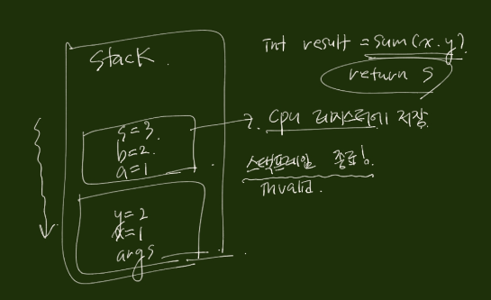

### 쓰레드를 종료해야하는 이유
- 메모리와 커널리소스를 사용함
- CPU 사이클과 캐쉬메모리 사용
- 쓰레드가 작업을 끝냈으나 어플리케이션은 여전히 작동중이라면  
쓰레드의 리소스를 정리해야함
- 쓰레드가 오작동이라면 (응답이 없는 서버에 계속 요청을 보내는..) 중지해야함
- 어플리케이션 중지하려면 모든 쓰레드가 중지되야함
 
### 언제 우리가 쓰레드를 인터럽트 할 수 있을까?

- 스레드가 인터럽트익셉션을 throws하는 메소드를 실행하려하면
- 스레드의 코드가 인터럽트 시그널을 명백히 핸들링하려하면

### thread coordination
- 스레드가 예상 시간 안에 작업을 완료하게 만드는 법
- 특정작업을 병렬처리 
- 스레드의 실행순서 시나리오는 다양하게 존재
- 스레드 A의 출력을 스레드 B가 입력으로 받는다면? 반복문으로 스레드 A의 작업이  
종료될 때 까지 대기 그러나 이러한 대기가 스레드 B의 문맥교환시 오버헤드(CPU 사이클)가 발생함
- 스레드 A의 작업이 끝나고 입력을 받을 수 있을 때까지 sleep(대기) 하고 wake up

### Summary 
- 실행 순서에 의존해선 안된다.
- 항상 thread coordination을 사용하라
- 최악의 시나리오를 산정하고 디자인하라
- 스레드는 비상식적으로 긴 시간을 잡아먹을지도 모른다.
- 스레드 조인을 사용할 때는 시간제한을 적어라! (thread.join(*timelimit*))

### 성능 및 지연시간 최적화
- latency(지연시간) : 일련의 작업이 끝나는데 걸리는 시간. 단위시간으로 측정됨
- throughput : 주어진 period 안에 완료되는 작업들의 양 단위시간, 단위작업으로 측정됨
- task/latency(T) -> T/N  
- 이론적인 latency(T)/N의 절감 방법은 factor of N의 성능개선임
- N = ?
  - original task를 얼마나 많은 subtasks/threads로 쪼갤 수 있는가??
  - On a general purpose computer: N = number of cores
  - 하나의 스레드만 추가해도 생산성이 떨어져 성능저하와 지연시간이 늘어남  
  문맥 교환(시분할), 캐시 성능 저하(캐쉬 메모리 사용), 추가 메모리 소비(스레드에 대한 TCB?)
  - threads = cores : 모든 스레드들이 실행될 수 있고 인터럽트가 발생하지 않는 상태에서 작동할 경우 최적임  
  IO/blocking calls/sleep  etc..   
  CPU를 많이 소모하는 작업이 running중이지 않다 라는 추정
    - Hyperthreading : 코어 하나가 두 개의 스레드를 실행 물리적인 코어의 하드웨어 유닛 일부를 복제하여  
    두 스레드가 병행으로 실행되고 하드웨어 유닛 일부가 공유됨 (모든 스레드를 병렬로 실행할 수는 없음 -> 근접함)
  
  - original task를 쪼개고, result를 합산하는데에 비용/대가는 없는가?(오버헤드)
  - 어떤 작업이든 원하는 만큼의 하위 작업으로 나눌 수 있는가?

### 하나의 작업을 여러작업으로 나누었을 때(Perallelization and Aggregation) 수반되는 비용

- 하나의 작업을 여러 작업으로 분할비용
- 스레드 생성, 작업을 스레드에게 전달비용
- thread.start() (운영체제에게 위임) & 스레드 스케쥴링 비용
- 마지막 스레드가 끝나고 신호를 보낼때 까지의 시간비용
- 통합 스레드가 신호를 받아 실행하는 비용
- 하위 작업을 하나의 아티팩트로 통합하는 비용

### 어떤 작업이든 분할할 수 있는가?

- 본질적으로 병행 가능하며 하위 작업으로 쉽게 분할되는 작업
- 처음부터 싱글스레드밖에 사용할 수 없는 작업
- 부분적으로 하위 작업으로 나눌 수 있고 순차적으로 실행해야하는 작업

### Summary 
- 성능이라는 용어은 다양하게 정의되며 실제로 측정과 개선에 관심 있는 성능 메트릭은 경우  
에 따라 그때그때 정의해야함
- 멀티스레드 어플리케이션 성능 기준
  - Latency
  - Throughput
- 작업을 분할하고 병렬실행 함으로써 레이턴시 절감
- 문제를 여러 하위문제로 분할하여 (분할정복?)해결하게 된다면 속도향상을 누릴 수 있음
- 코어보다 더 많은 스레드는 블로킹 호출이 없고 단순한 계산만 하는 문제에 역효과를 낳음
- 멀티스레드로 알고리즘을 작동하는 내재비용이 있음

### +a 이미지 처리, 색 공간, 추출 및조작
- 디지털 이미지에서 **픽셀**이란 화면에 표시되는 그림의 가장 작은 요소임
- 이미지는 2차원적인 픽셀의 집합이고 다양한 방법으로 인코딩됨
- 픽셀 색상 인코딩 그룹 
  - Y'UV - 루마(밟기) 및 2개의 크로마(색상) 컴포넌트
  - RGB - 빨강, 초록, 파랑
  - HSL and HSV - 색조, 채도, 밝기/명도
  - CIE XYZ - 장비 독립적인 빨강, 초록,
- ARGB 메모리 표현


### 스레드 풀링 / 처리량

- Throughput : 주어진 기간안에 완료되는 작업량, 단위 시간(초)으로 처리량을 측정
- Original Task에 대한 Latency T -> Throughput = 1(original task)/T
- Sub-task로 분할하여 정복한다면 각 task는 T/N의 시간안에 완료되고  
처리량은 N배 증가하게 됨 1/(T/N) = N/T 
- 그러나 작업을 N개로 분할 하여도 지연 시간이 줄지 않아 N/T보다 낮은 처리량을 얻을 가능성이  
농후함
- 작업이 내부적으로 연관되지 않고 별개임 따라서 각 작업을 작은 작업으로 나눠야 하는  
전처리 필요성을 없앨 수 있음
- 또한 작업은 각각 하나의 결과만 갖기 때문에 작업을 포스트 프로세스할 필요가 없음
- 완전 별개의 작업이기 때문에 다른 작업의 완료를 위해 그 작업이 끝나길 기다리지 않아도 됨
- 스레드 풀링 / 논블로킹 대기열로 최적의 처리량을 얻을 수 있음

### 스레드 풀링
- 스레드를 생성하면 풀에 쌓임 request(미래의 작업)이 요청되면 스레드 풀에 있는 스레드를 사용
- 작업이 대기열을 통해 스레드별로 분배
- 스레드는 이용 가능할 때마다 대기열을 통해 작업을 받음
- 모든 스레드가 바쁘면 대기열에 머무르고 최대 처리량과 리소스의 최대 사용률을 얻을 수 있음
- 스레드풀 구현은 구현할만한 가치가 있음 (낮은 오버헤드, 효율적인 대기열을 구현)
- 고정 스레드 풀 실행기
  - int numberOfThreads = 4;
  - Excutor executor = Executors.newFiexdThreadPool(numberOfThreads);
  - Runnable task = ...;
  - executor.execute(task);
  
### Summary

- 각각의 작업을 스레드에 제공함으로써, 처리량을 N배 향상시킬 수 있다
- 고정스레드풀을 사용하면 고정된 스레드수를 유지하면서 스레드 재생성 필요성을 제거가능
- 상당한 성능향상(N배 처리량)

### HTTP 서버 && throughput
- 물리 코어 수 & 가상 코어 수 만큼 선형적으로 증가 물리 코어 > 가상 코어 throughput 증가율
  해당 작업은 논블로킹 작업이기 때문에 가상 코어수 만큼의 스레드를 생성하였을 때 최대 처리량을 가짐


### 스택 메모리 / 힙 메모리

- 스택 메모리 : 메소드가 호출됨, 인수가 넘겨짐, 지역 변수가 저장됨
- 스택 + 명령어 포인터 = 스레드의 실행 상태 (+a 스택프레임은 변수의 동적링크 정적링크 등등을 가짐)

#### 스택 메모리
```java
void main(String[] args) {
    int x = 1;
    int y = 2;
    
    int result = sum(x, y)
}

int sum(int a, int b) {
    int s = a + b;
        
    return s;
}
```



- 스택에 입력된 모든 변수는 특정 스레드에 속함 -> 다른 스레드는 접근 불가(세그먼트 에러)
- 스레드가 생성될 때 정적으로 할당됨
- 스택의 사이즈는 고정되어있고, 런타임 도중에 변경불가  상대적으로 작음(플랫폼에 따라)
- 계층적으로 깊게 호출시(ex 재귀호출) 스택오버플로우 예외발생(+a 스택 메모리와 힙 메모리는 나눠 사용하기  
때문에 스택 메모리가 힙 메모리의 영역을 넘어버리는 예외)

#### 힙 메모리
- 무엇이 힙 메모리에 할당되는가?
  - 모든 객체가 할당됨 new 연산자에 의해 생성되는 인스턴스
  - String, Object, Collection...
  - Members of classes (멤버 변수/메소드?)
  - Static Variables

- 힙은 JVM의 Garbage Collector가 Govern, Manage 함
- Objects : 해당 객체에 참조를 가지는한 힙 메모리에 머뭄(참조 카운터)
- Member of classes : 그들의 부모가 존재할 때까지 존재(그들의 부모와 같은 라이프 사이클을 가짐)
- Static variables : 런타임 시작과 끝

#### Objects verse References

- Object referenceVar1 = new Object(); 
- Object referenceVar2 = referenceVar1; // referenceVar1이 참조하는 인스턴스의 주소를 할당
- 3개의 Entity 참조변수 2개와 힙 메모리에 할당된 Object 인스턴스

#### 무엇이 어디에 할당되는가?

- References 
  - reference가 메서드의 로컬 변수로 선언되면 reference는 스택에 할당됨
  - 클래스의 멤버일 경우 힙 메모리에 할당됨 

### 스레드간 자원공유
- 자원이 무엇인가?
  - Variables (integers, Strings ..) 
  - Data structure (배열, 컬렉션, 맵)
  - File or connection handles (파일 객체, 네트워크, 데이터베이스 커넥션)
  - Message or work queues (메세지 큐..)
  - etc

#### 왜 자원공유를 하려하는가?


### The Core Problem

- InventoryCounter 객체는 힙 메모리의 공유된 객체임
  - items 멤버변수가 두 개의 스레드 사이에서 공유되고 있음
- items++ items--
  - 동시에 발생
  - 원자적 작업이 아님(ACID의 A)

#### Atomic Operation
- 연산이나 일련의 연산들은 원자적일 것으로 고려됨, 다른 시스템에게 보이기에는 마치 동시에 실행된 것처럼 보임
- Single step - "all or nothing" 한 개의 단계(양자택일)
- 중도개입하여 중간 상태를 관찰할 수 없음

#### item++ : NOT AN ATOMIC OPERATION
1. 메모리에 저장된 items의 현재 값을 가져옴
2. 현재의 값에 1을 더하고
3. 그 결과를 items 변수에 저장함

### <a href="head1">Items++ and items-- concurrently (동시성문제)</a>


### Summary
- 스레드간의 자원공유의 이점
- 멀티스레딩 프로그래밍의 문제점
- 대표적인 예시(원자적 연산이 아닌 경우, 동시(병행)적으로 다른 스레드에의해 수행되는 동시성 문제)
 
### 동시성 문제
- 두 개의 쓰레드가 itemCounter를 공유
- 둘 다 itemCounter를 동시에 read / write를  함
- 그 연산들이 아토믹하지 않음

```java
void aggregateFucntion() { 
    // enter critical section : 임계영역 
    operation1();
    operation2(); // ThreadA가 실행중일 때 ThreadB가 접근 불가
    opertaion3();
    // exit critical section 
    ...
}
```

### Synchronized (동기화)
- Locking 매커니즘
- 임계영역, 메소드 전체의 접근을 한 시점에 하나의 스레드에게만 제한을 검
- synchronized가 객체마다 각각 적용되어 있으면 '메소드 전체의 접근'이 막힘

#### 메소드에 임계영역 정의
```java
public synchronized method1() {
    // ...ThreadA가 실행중    
}

public synchronized method2() {
    // ... ThreadA가 method1 호출하고있어 ThreadB가 method2에도 접근 불가
}

```

#### 임계 영역으로 간주되는 코드의 블록을 정의하고 액세스 제한
```java
public class ClassWithCriticalSections {
    Object lockingObject = new Object();
    
    public void method1() {
        synchronized (lockingObject) {
            /*
             * 
             * 임계 영역
             * 
             * 
             * */
        }
    }
  
}
```

#### 임계영역 블록으로 정의

```java
void increment() {
  synchronized(this) {
      items++;
  }
}

void decrement() {
  synchronized(this) {
      items--;
  }
}
```

```java
public class ClassWithCriticalSections {
  Object lockingObject1 = new Object();
  Object lockingObject2 = new Object();

  public void method1() {
//      조건문으로 임계영역을 분기하거나 등등.. 전체를 임계영역으로 지정할 필요가 없음
    synchronized (lockingObject1) {

    }
  }
  public void method2() {
    synchronized (lockingObject2) {
        
    }
  }
  
}
```

### Synchronized Lock
- Synchronized block은 재진입 가능
- 스레드 스스로 임계영역으로 들어가는 것을 막을 수 없음

### Summary
- 병행성(= 동시성) 문제의 공식적 정의
- 임계영역을 선언함으로써, 원자적으로 실행할 필요가 있는 코드를 식별할 수 있음. 
- 임계영역을 보호하는 Synchronized 키워드의 두 가지 사용법 
  - 메소드에 선언
  - 명시적 객체를 사용하여 임계영역 블록을 정의 flexible and granular but verbose

### 언제 동기화 해야하나?

![동기화사진]
- 동시 실행이 되지 않을 뿐더러, 문맥 교환비용 메모리 비용까지 오버헤드가 큼

### 아토믹 연산
- 어느 연산이 원자적인가?
- 불행히도 모든 연산은 원자적이지 않음
- 모든 참조 할당은 원자적임
- 우리는 참조를 오브젝트로 부터 원자적으로 get & set  할 수 있음
```java
public int[] getAges() {
  return this.ages;
}

public void setName(String name) {
    this.name = name;    
}

public void setPerson(Person person) {
    this.person = person;    
}
```
### 아토믹 연산 - Primitive Types
- 모든 원시타입 할당은 안전함 <span style="color: red">**long과 double을 제외하고**<span>
  - int, short, byte, float, char, boolean
- long과 double은 왜?
  - ```
    long x = 5;
    long y = 10;
    
    x = y; // 길이가 64비트라서 Java가 보장해주지 않음 32비트 32비트 2번의 연산
    
    volatile double x = 1.0
    volatile double y = 9.0
    
    x = y // 아토믹 연산
    ```
    
### 아토믹 연산
- 자바의 아토믹 패키지가 있음
- 원자적 연산이 가능하고 락이 걸리지 않은 상태의 더 고급인 다른 클래스도 다수 지원함
- 비원자적 연산 -> 원자적 연산
 
### 메트릭 유즈케이스
```java
public class BusinessLoginClass {
    
    public void businessLogic() {

      long satrt = System.currentTimeMillis();
      // important operation
      long end = System.currentTimeMillis();
      
      long duration = end - start;
      f
      captureSample(duration);
    }
  
  
    
}
```

### Summary
- 아토믹 연산
  - 원시타입 할당(double, long 타입 제외)
  - 포인터 할당
  - volatile keyword double, long
- 메트릭 캡쳐 유즈케이스
- 원자적 연산에 대한 지식은 고성능 정확한 값의 핵심

### 경쟁 조건
- 다수의 스레드가 공유된 자원에 접근하는 조건
- 최소 하나의 스레드가 자원을 수정
- 스레드의 스케쥴링 타이밍이 부정확한 결과를 초래
- 핵심 문제는 공유된 자원에서 수행되는 비원자적 연산들임  
  [IncrementingThread vs DecremetingThread](#head1)